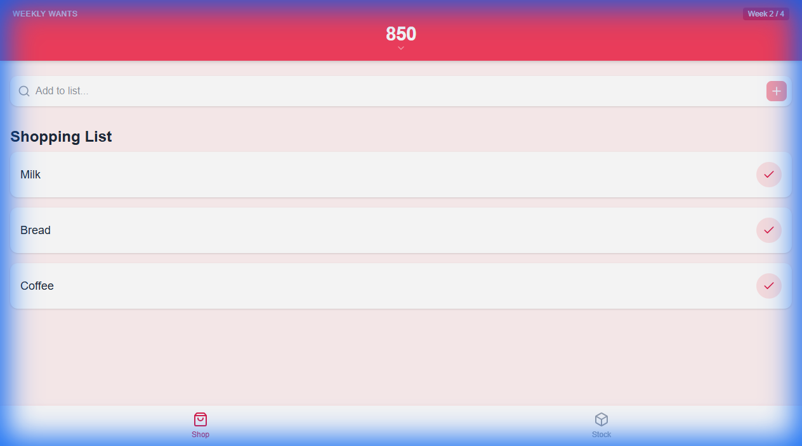
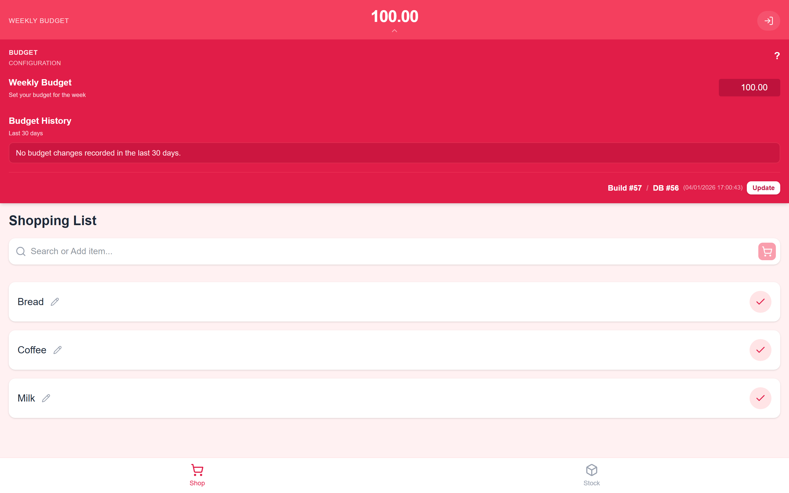
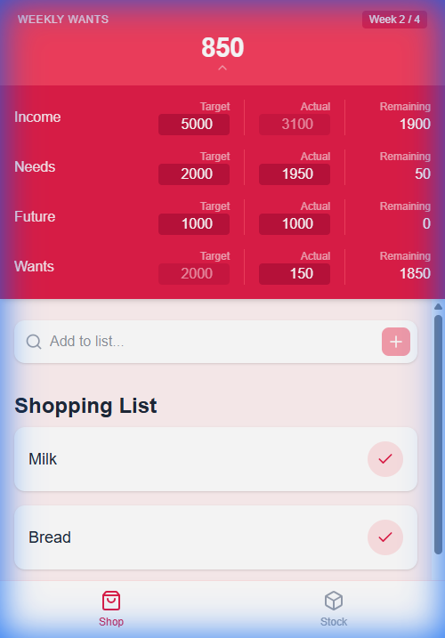
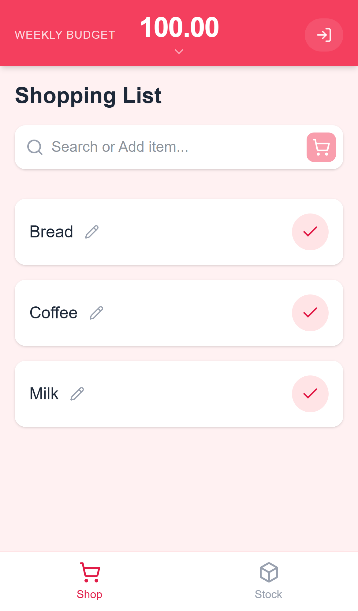

# Shopping Spree 🛍️

**Shopping is Free (if you budget right)**

A playful, "Retail Therapy" themed Progressive Web App (PWA) designed to make budgeting fun and shopping guilt-free. Built with **React**, **Vite**, and **Tailwind CSS**.



## Features

### 1. The "One Truth" Header
Always know exactly what you can spend **this week**.
- **Smart Calculation**: Your "Wants" budget (derived from Income - Needs - Future) is divided by the number of Saturdays in the month.
- **Rollover Logic**: Unused budget from previous weeks automatically rolls over to the current week.
- **Details**: Click the header to see your full financial breakdown (Income, Needs, Future, Wants).



### 2. Shop & Stock Flow
- **Stock Tab**: Your master inventory (Pantry/Fridge). Search for items or add new ones here.
- **Shop Tab**: Your active shopping list.
- **Action**: Moving an item from *Stock* to *Shop* marks it "To Buy". Marking it "Bought" in *Shop* triggers a confetti celebration 🎉.

### 3. Mobile First Design
Optimized for mobile use with a thumb-friendly persistent footer and responsive layout.

| Android | iPhone |
|:---:|:---:|
|  |  |

## Tech Stack
- **Framework**: React + Vite
- **Styling**: Tailwind CSS (v4)
- **State**: React Context (Storage Adapter Pattern)
- **Testing**: Vitest

## How to Run

1. **Install Dependencies**
   ```bash
   npm install
   ```

2. **Start Dev Server**
   ```bash
   npm run dev
   ```

3. **Deploy**
   ```bash
   npm run deploy
   ```
   (Deploys to GitHub Pages)

## Configuration

### GitHub Pages Deployment
To deploy to GitHub Pages, you need to configure the base URL:

1. Open `vite.config.js`
2. Update the `base` property to match your repository name:
   ```javascript
   export default defineConfig({
     // ...
     base: '/your-repo-name/', // e.g. '/shopping-spree/'
     // ...
   })
   ```

### Firebase Setup (Optional)
The project is set up to support Firebase as a backend, replacing LocalStorage.

1. **Create Firebase Project**: Go to [Firebase Console](https://console.firebase.google.com/) and create a new project.
2. **Add Config**:
   - Get your web app configuration object from Firebase.
   - Open `src/services/storage.js`.
   - Update `DEFAULT_SETTINGS` (or create a new config constant) with your Firebase credentials.
3. **Enable Integration**:
   - In `src/services/storage.js`, implement the methods marked with `TODO: Add Firebase check`.
   - Update the `saveSettings` and data retrieval methods to switch between `localStorage` and `firebase` based on the `useFirebase` flag.
